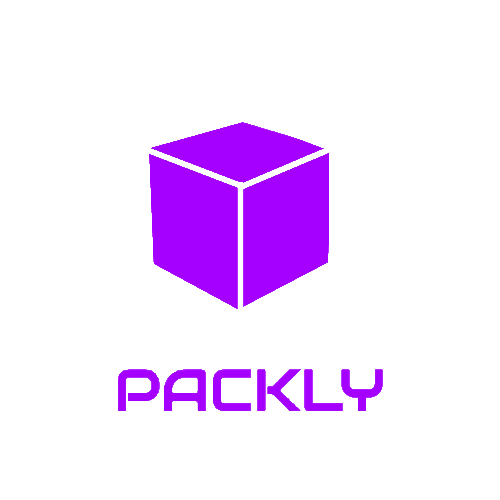

<p align='center'>
  
</p>

If you want to take a look on all the screens of the App, the are [here](https://www.figma.com/file/qtIeOUdyQQiRn3FfKfdgTc/Packly?node-id=1%3A15).

## About this Project

The idea of the App is:

_"Help people track your package and provide a simple way to see where it is"_

## Why?

This project is part of my personal portfolio. I'll be happy if you could provide me any feedback about the project, code, structure or anything that you can report. That could make me a better developer!

Email-me: arthurcastilhos@gmail.com

Connect with me at [LinkedIn](https://linkedin.com/in/arthrc)

Also, you can use this Project as you wish, be for study, be for make improvements or earn money with it!

It's free!

## Some observations about this App

1- It's in development, so a lot of features isn't working now.

## Funcionalities

- Track your package using the Correio's code.
- Save your packages to easily review them
- Enable notifications, which will alert each update that your saved package receives

## Getting Started
### Prerequisities

To run this project in the development mode, you'll need to have a basic environment to run a React-Native App, that can be found [here](https://facebook.github.io/react-native/docs/getting-started)

## How to run the code locally?

 - Clone this repository.
 - Open the cloned repository folder and type ```npm install``` or ```yarn``` to install dependencies.
 - Run ```yarn dev```

## Contribuiting

You can send how many PR's do you want, I'll be glad to analyse and accept them! And if you have any question about the project...

Email-me: arthurcastilhos@gmail.com

Connect with me at [LinkedIn](https://linkedin.com/in/arthrc)

Thank You!

## License

This project is licensed under the MIT License - see the [LICENSE.md](https://github.com/arthrc/packly-server/license.md) file for details

## Other repositories:

- [Mobile](https://github.com/arthrc/packly)
